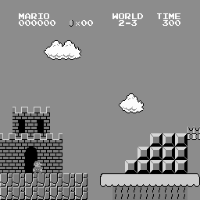
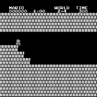

# Introduction
This is an implemention of PPO based on Super Mario, referred to an existing repository [here](https://github.com/uvipen/Super-mario-bros-PPO-pytorch). The `.ipynb` can't be run on Windows because the processes created for collecting data can't find the methods defined in jupyter notebook. 

# Results
There are some levels I have trained.

  
  
   
  
  
  
   

